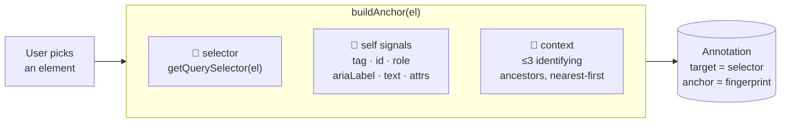
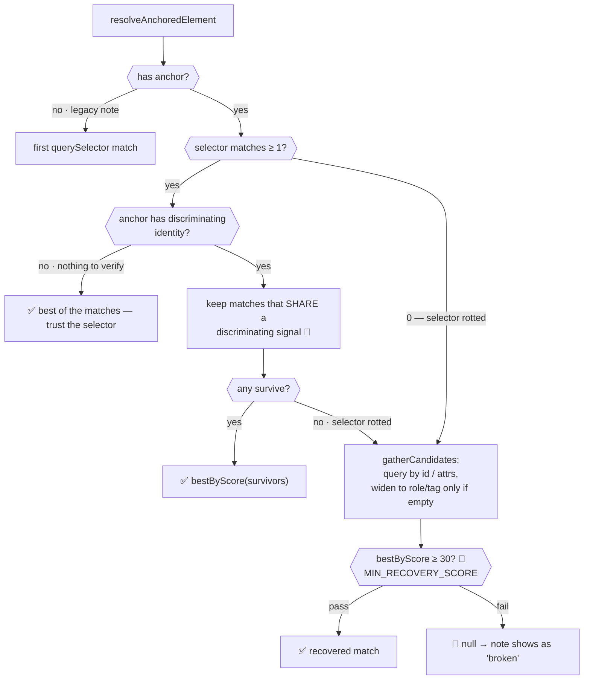
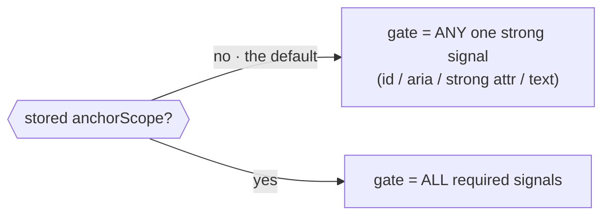
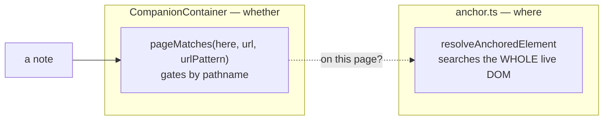

# ⚓ How note anchoring works

> **TL;DR** — a CSS selector alone is a liar: `th:nth-of-type(1)` matches many elements and silently re-points a note at the wrong one. So every note stores a **selector + identity fingerprint** (`AnchorMeta`). Resolution uses the selector to *find* candidates and the fingerprint to *verify* the right one — and when the selector rots, to *recover* by scoring nearby elements. Resolution is deliberately **page-agnostic**; page scoping is a separate gate. See [`anchor.ts`](anchor.ts).

---

## 🎯 The two moments

Anchoring has exactly two entry points, and everything else is a helper for one of them:

| Moment | Function | When | Job |
|---|---|---|---|
| **Capture** | `buildAnchor(el)` | note created / re-anchored | snapshot the element's identity |
| **Resolve** | `resolveAnchoredElement(target, anchor)` | every render / DOM change | find that element again, live |

---

## 🏗️ Capture — `buildAnchor(el)`

Records three layers of signal, strongest kept for scoring later ([`anchor.ts:123`](anchor.ts:123)):



Say the user pins the **Start Analysis** button, which sits inside an analysis toolbar:

```html
<section id="analysis-toolbar" role="region" aria-label="Product Analysis">
  <div class="flex gap-2">                     <!-- anonymous wrapper -->
    <button id="start-analysis" role="button" aria-label="Start Analysis"
            data-testid="analysis-btn">📈 Start Analysis</button>
  </div>
</section>
```

**① Self signals** — the element's own identity, each optional (captured only when present):

| Signal | Captures | Value from the example | Notes |
|---|---|---|---|
| `tag` | element type, lowercased | `"button"` | always present; coarsest signal |
| `id` | element `id` | `"start-analysis"` | strongest signal (+100 on match) |
| `role` | explicit `role` attribute | `"button"` | implicit roles are **not** captured |
| `ariaLabel` | accessible name — `aria-label`, else resolved `aria-labelledby` text | `"Start Analysis"` | survives text/icon changes |
| `text` | normalized visible text, capped at `TEXT_MAX = 120` | `"📈 Start Analysis"` | whitespace collapsed |

**② Stable attributes** — the `STABLE_ATTRS` allow-list (test ids, `name`, `placeholder`, `href`, `for`, …) **plus any `data-*`**, since apps use those as identifiers ([`anchor.ts:51`](anchor.ts:51), [`:130`](anchor.ts:130)):

| From the example | Kept? | Why |
|---|---|---|
| `data-testid="analysis-btn"` | ✅ `{ "data-testid": "analysis-btn" }` | test id → near-unique handle (+40) |
| `class="flex gap-2"` | 🚫 dropped | styling, not identity — not in the allow-list |

**③ Context** — the twin-breaker: up to `MAX_CONTEXT = 3` ancestors, nearest-first, but *only* ones we can re-identify (id, test id, accessible name, or a sectioning `role`). Walking up from the button ([`buildContext`, `anchor.ts:111`](anchor.ts:111)):

| Ancestor | Recorded? | Why |
|---|---|---|
| `<div class="flex gap-2">` | 🚫 skipped | anonymous wrapper — no re-identifiable signal |
| `<section id="analysis-toolbar" role="region" …>` | ✅ `{ tag, id, role, ariaLabel }` | has an id + sectioning role — pins the right copy |

This is what tells two identical **Start Analysis** buttons in two different toolbars apart, even when the buttons themselves are byte-for-byte identical.

Put together, `buildAnchor` stores:

```jsonc
{
  "selector": "#start-analysis",
  "tag": "button", "id": "start-analysis", "role": "button",
  "ariaLabel": "Start Analysis", "text": "📈 Start Analysis",
  "attributes": { "data-testid": "analysis-btn" },
  "context": [
    { "tag": "section", "id": "analysis-toolbar", "role": "region", "ariaLabel": "Product Analysis" }
  ]
}
```

---

## 🔍 Resolve — `resolveAnchoredElement(target, anchor)`

Two tiers — verify a live selector match, else recover ([`anchor.ts:273`](anchor.ts:273)):



| Tier | Trigger | Behaviour | Guard |
|---|---|---|---|
| **Verify** | selector → N ≥ 1 elements | keep only matches that corroborate a discriminating signal, then `bestByScore` | must share id / accessible name / strong attr / exact-or-prefix text |
| **Recover** | selector → 0 elements, *or* no match corroborates | gather candidates from identity signals, filter by the same corroboration gate, then score | must corroborate **and** clear `MIN_RECOVERY_SCORE = 30` |

👉 **A matching selector is not proof, and neither is being in the right container.** A class/`nth-of-type` selector can rot onto a lookalike sibling once the real target is removed (the "Start Analysis → Excel Export" bug). `context` (+25) and `tag` (+5) are shared by every sibling in that container and together *reach* the recovery floor — so structure alone can't tell the target from its neighbour. Both paths therefore require the candidate to corroborate an **element-specific** signal (id / accessible name / strong attr / exact-or-prefix text) before it can be adopted; context and tag/role only *rank* the survivors. Only anchors with **no** discriminating identity (nothing to verify with) keep plain selector-trust; those tend to be id-selected anyway, where the selector can't rot. When nothing corroborates, `null` → the note surfaces as broken rather than hijacking an unrelated element.

---

## 🎲 The scoring formula — `scoreCandidate`

Higher = better fit. Weights favour signals apps rarely reuse across unrelated elements ([`anchor.ts:188`](anchor.ts:188)):

| Signal | Points | Why that weight |
|---|---|---|
| **`id` exact match** | **+100** | near-unique per page |
| **test-id / `name` / `for` attr** | +40 each | intentionally unique handles |
| **accessible name (aria)** | +40 | human-facing identity |
| **exact `text`** | +30 | strong, but repeats (buttons, labels) |
| **context ancestor (id/test-id)** | +25 each | pins the right *copy* of a twin |
| **generic attr (`type`, …)** | +15 each | weak — many share it |
| **text prefix match** | +12 | tolerates truncation/appended text |
| **context ancestor (role)** | +10 each | sectioning hint |
| **`role` match** | +8 | coarse |
| **tag match** | +5 | coarsest |

**Why the floor is `30`:** exactly one strong signal — an `id`, a test id, an accessible name, or exact text — clears it. `tag` (5) or `role` (8) **alone cannot**, so recovery never re-anchors onto "some other button" just because it's a button.

---

## 🎛️ Anchor scope — letting the user set the strictness

Everything above is the **default** contract. A note may also store an
`anchorScope`: a per-signal choice the user makes in the composer's anchor editor
([`AnchorScopeEditor`](../companion/ui/src/companion/AnchorScopeEditor.tsx)),
keyed by the signal ids `anchorSignals(anchor)` produces ([`anchor.ts`](anchor.ts)).

| State | Meaning |
|---|---|
| `required` | the candidate **must** carry it |
| `hint` | only ranks the survivors |
| `ignored` | invisible to the gate *and* the score |



**The two gates differ on purpose.** The default is an **OR** — one strong signal
corroborating is enough — while a stored scope is an **AND**. Switching every note
to the stricter rule would break notes that resolve correctly today, so `Smart`
(the editor's default) is stored as *nothing at all*: absent scope, default path.
Only `Exact`, `Loose` or a hand-tuned chip writes a scope.

Three things follow from that, each with a test in
[`resolve-scope.test.ts`](../companion/ui/tests/utils/anchor/resolve-scope.test.ts):

- **A scope never gates on a key it doesn't name.** An unlisted signal defaults to
  `hint`, so a scope saved before the element gained a `data-testid` can't start
  rejecting candidates over it.
- **`position` is the odd one out.** It decides *where we look*, not what we
  accept: `required` pins the note to its stored selector and disables recovery
  entirely, so a rotted selector surfaces as broken instead of re-finding the
  element elsewhere. That is what makes `Exact` exact.
- **Re-anchoring always drops the scope** ([`reanchorScope`](../companion/ui/src/companion/helpers.ts)).
  It is keyed to the *old* element's signals; the new one has its own.

Storage mirrors `urlPattern`: written as `anchorScope ?? null` on every update, so
resetting a note back to `Smart` clears it rather than leaving the old scope behind.
The export path strips it — a baked `[data-docio-note-id]` target is already unique,
and a stale scope could only reject the very element the exporter stamped.

---

## 🔗 Anchoring vs. page scoping (important)



- **Resolution has no idea what page it's on.** `gatherCandidates` will happily match a lookalike element anywhere in the document ([`anchor.ts:244`](anchor.ts:244)).
- **Page identity is enforced upstream**, by `pageMatches` in [`CompanionContainer.tsx`](../companion/CompanionContainer.tsx) — *not* here.
- **Scope widens by pattern, never by accident.** With no `urlPattern` a note matches one exact path. `urlPattern` (built by clicking chips in `PageScopeEditor`) generalises it:

  | Pattern | Matches |
  |---|---|
  | `/en/report/*` | any value in that one segment — not `/en/report/a/b` |
  | `/docs/**` | `/docs` and any depth below it (`**` is zero-or-more whole segments) |
  | `/a/**/b` | `/a/b`, `/a/x/b`, `/a/x/y/b` |
  | `/**` | every page — for a note on a global component |
  | `/*?tab=repositories` | any top-level page, but only on that tab |

- **Query params are opt-in.** Paths alone decide identity ([`toRelativeUrl`](../companion/helpers.ts)), so `?documentation-id=…` and `#hash` never split one page into several. A param constrains matching only when a pattern names it explicitly, and params the pattern doesn't name are ignored — `?tab=repositories&q=x` still matches `?tab=repositories`.
- **This split caused the SPA leftover-pins bug.** On soft navigation the URL gate wasn't firing, so stale notes stayed "on page" and the resilient resolver re-anchored them onto lookalikes on the new page. The fix restored the URL gate; anchoring itself was working as designed. Do **not** try to make `resolveAnchoredElement` page-aware — keep the "where" and the "whether" separate.

---

## 🔧 Tuning knobs (all in [`anchor.ts`](anchor.ts))

| Const | Value | Effect if raised |
|---|---|---|
| `MIN_RECOVERY_SCORE` | `30` | stricter recovery → fewer wrong matches, more "broken" pins |
| `MAX_POOL` | `500` | more candidates scored → slower on huge pages |
| `MAX_CONTEXT` | `3` | deeper ancestor fingerprint → better twin-breaking, larger payload |
| `TEXT_MAX` | `120` | longer stored text → more precise, larger payload |

---

## ✅ Mental model to keep

- **Selector = fast path, fingerprint = safety net.** Never trust a bare selector to be unique.
- **Verify then recover** — a live selector match still has to corroborate the fingerprint; when it doesn't (or the selector resolves to nothing), recover only on evidence that clears the floor.
- **Broken ≠ bug.** A `null` resolve is the system correctly refusing a bad match; the note surfaces as broken so the user can re-anchor.
- **Keep anchoring page-blind.** Page membership is decided before we ever call the resolver.
- **Absent scope is a contract, not a gap.** The default path is deliberately more forgiving than any stored scope, so never "fill in" a default scope on save.
