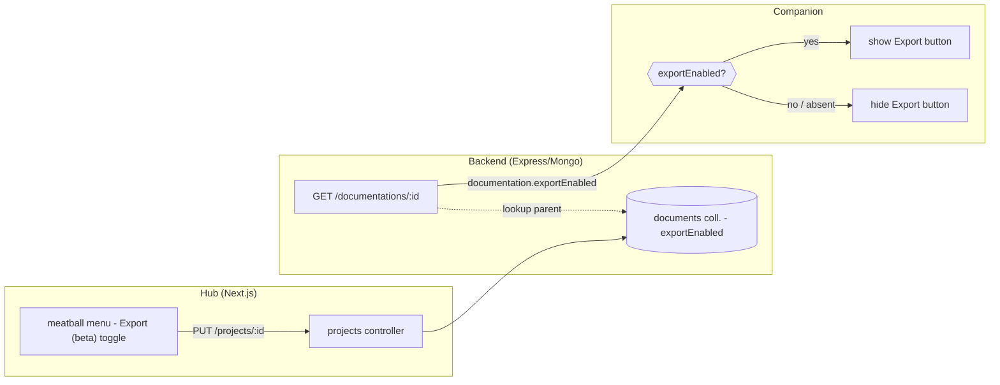

# Gate page-export behind a per-project "Export (beta)" lever

> **Status:** planned, not started. Context: the self-contained HTML page-export
> (companion "Export this page") ships as-is — it works well for simple sites. We
> are **not** hardening or hosting it yet. This plan only controls *who can produce
> it*, via a per-project opt-in flag.

> **TL;DR** — Add a per-project `exportEnabled` flag, **off by default**, flipped
> from a new **meatball (⋯) menu** on the project page — which also absorbs the
> existing **Import** and **Upload assets** actions. The companion only shows its
> "Export this page" button when the project has it enabled. KISS / YAGNI.

---

## What we want

- **Opt-in per project** — export is a beta capability a user deliberately turns on
  for specific projects; **disabled by default** (including all existing projects).
- **Tidy the project header** — collapse `Import` + `Upload assets` into a `⋯`
  meatball menu; keep `Add documentation` as the primary button. The export toggle
  lives in that menu.
- **Companion honours the flag** — the footer `⬇ Export this page (beta)` button
  appears only when the project is export-enabled.

---

## How the flag flows

The one design choice: **denormalize `project.exportEnabled` onto the
`GET /documentations/:id` response** so the companion (which already holds the
documentation object) gates without a second fetch.

---

## What we touch

**Legend:** ♻️ reuse as-is · ✏️ modify · ✨ new

### Backend (`libs/`)
- ✏️ `libs/models/project.ts` — add `exportEnabled?: boolean` to the `Project` interface.
- ✏️ `libs/database/project.ts` — add `exportEnabled: data.exportEnabled ?? false` to
  the explicit `$set` allowlist in `update` (else the existing `PUT` silently drops
  it). Optionally stamp `exportEnabled: false` in `insert` for cleanliness — not
  required (absent === false).
- ✏️ `libs/controllers/documentations.ts` — in `GET /:id` (≈L20–30), instantiate
  `ProjectDB` (already imported/used in `projects.ts`), fetch the parent via
  `doc.projectId.toString()`, and attach `doc.exportEnabled = project?.exportEnabled ?? false`
  before serializing. (`projectId` is an `ObjectId` — call `.toString()`.)
- ♻️ `PUT /projects/:id` already exists — **no new route**.

### Companion (`companion/ui/`)
- ✏️ `companion/ui/src/companion/CompanionContainer.tsx` (the `onExport` gate, ≈L421) —
  `onExport={READ_ONLY || !documentation?.exportEnabled ? undefined : handleExport}`.
  `READ_ONLY` still short-circuits first, so exported files (no live backend) are
  unaffected. `documentation` is untyped `any` from SWR — **no type change**.
  `CompanionPanel` already hides the footer when `onExport` is undefined, so no other
  companion change.

### Hub (`ui/`)
- ✏️ `ui/data_access/models/project.ts` — add `exportEnabled?: boolean` to the client
  `Project` interface.
- ✏️ `ui/app/projects/[id]/page.tsx` — in `.hub-detail-actions`, replace the standalone
  **Import** and **Upload assets** buttons with a `MeatballMenu` (`@/components/hub`) whose
  `items` are:
  1. **Enable/Disable export (beta)** — a click-to-toggle item whose label + icon
     reflect `project.exportEnabled` (e.g. `Check` when on). `onClick` →
     `edit(projectId, { ...project, exportEnabled: !project.exportEnabled })` then
     `mutate(SINGLE_PROJECT_KEY(projectId))` + `toast(...)` — mirroring the existing
     `toggleActive` handler in the same file.
  2. **Import** — `onClick: () => setImportOpen(true)` (unchanged behaviour,
     `separatorBefore: true`).
  3. **Upload assets** — `onClick: () => router.push(\`/projects/${projectId}/upload\`)`.
  Keep **Add documentation** as the primary button beside the meatball.
- ♻️ Reuse `MeatballMenu`, `Toggle` (if we later want an inline switch), `useHubToast`,
  `edit()` (`ui/data_access/api/projects.ts` — `PUT /projects/:id`), `SINGLE_PROJECT_KEY`,
  `ImportForm`/`HubModal` — all already present.

**Meatball note:** `MeatballMenu`'s `MenuItem` is click-only and auto-closes. Using a
**click-to-toggle menu item** (label/icon reflect state; toast confirms) avoids
touching the shared component. Extending `MenuItem` to host an inline non-closing
`Toggle` is possible later polish — deferred (YAGNI).

**Cut (per decision):** no redaction/leakage step, no provenance banner, no hosted
share link. Export stays the current beta artifact; this change only controls *who
can produce it*.

---

## Default-off behaviour (no migration)

Mongo is schemaless and the collection stores projects without the field today →
`exportEnabled` reads as `undefined` → `!documentation?.exportEnabled` is `true` →
**export hidden**. Existing and newly-created projects are therefore export-disabled
until explicitly toggled on. No backfill needed. (`ProjectDB.insert` does not stamp a
default; the "absent === false" convention covers new projects too.)

---

## Reference: key files found during exploration

- Project model: `libs/models/project.ts` (plain interface, no validation lib).
- Project DB: `libs/database/project.ts` — collection is literally `'documents'`;
  `update` uses an explicit `$set` allowlist (title/description/status/updated).
- Projects controller: `libs/controllers/projects.ts` — `PUT /:id` at ≈L124–135.
- Documentation DB: `libs/database/documentation.ts` — collection `'pages'`; `get(id)`
  is a plain `findOne`, no `$lookup`.
- Documentation controller: `libs/controllers/documentations.ts` — `GET /:id` ≈L20–30.
- Companion data access: `companion/ui/src/data_access/documentations.ts`
  (`useDocumentation`, returns `any`).
- Hub project page: `ui/app/projects/[id]/page.tsx` — `.hub-detail-actions` row
  (≈L87–97); `toggleActive` handler (≈L40–47) is the mutation pattern to mirror;
  `ImportForm` opened via `HubModal` (≈L125–131).
- Hub components: `MeatballMenu`, `Toggle`, `useHubToast` in `ui/components/hub/`
  (barrel `ui/components/hub/index.ts`); CSS classes in `ui/app/hub.css`.
- Hub data access: `ui/data_access/api/projects.ts` (`edit`), `ui/data_access/swr/projects.ts`
  (`useProject`, `SINGLE_PROJECT_KEY`, `ALL_PROJECTS_KEY`).
- Client Project type: `ui/data_access/models/project.ts`.

---

## How we'll know it works

- [ ] Backend up (`server.ts`, port 5000/5001) + Hub dev server (`ui`, port 3000).
- [ ] Project page shows a `⋯` meatball containing **Export (beta)** toggle + **Import** +
      **Upload assets**; `Add documentation` stays primary.
- [ ] Toggling **Export (beta)** on → `PUT /projects/:id` persists `exportEnabled: true`;
      toast shown; reopening the menu reflects the new state.
- [ ] `curl GET /documentations/:id` for a documentation in that project returns
      `exportEnabled: true`; for a project left off, returns `false`/absent.
- [ ] **Import** modal still opens and imports; **Upload assets** still navigates to
      `/projects/:id/upload`.
- [ ] Companion (live, against the backend) on a documentation whose project is **off**
      → no footer Export button; flip the project **on**, reload → `⬇ Export this page (beta)`
      appears and still produces a working file.
- [ ] Verify the Hub meatball + toggle visually in the Browser pane via the `ui` dev server;
      verify the companion button show/hide via `CompanionPanel` Storybook (`onExport`
      present/undefined) since the container isn't storybooked.
