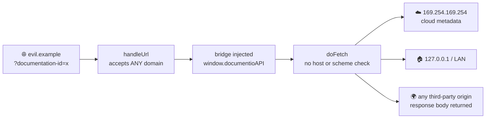
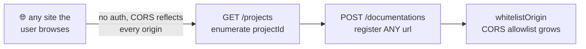
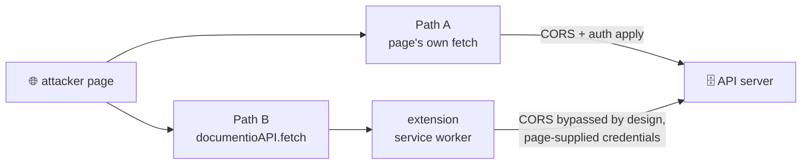
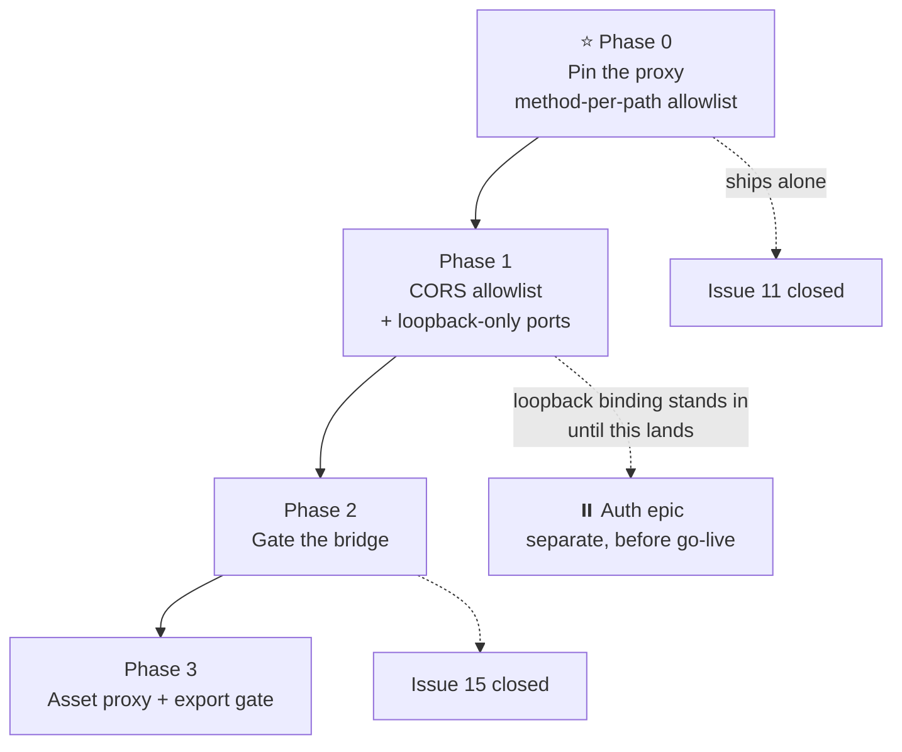
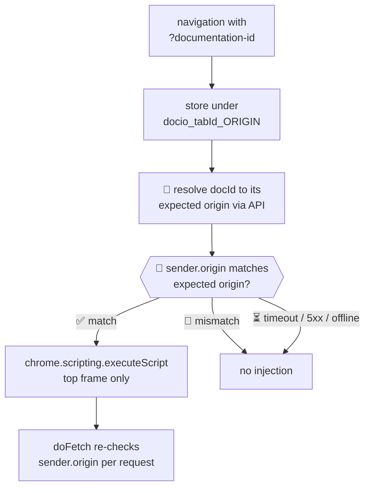

# 🔒 Extension proxy hardening — issues #11 & #15

> **TL;DR** — The companion extension is currently an open fetch proxy that any website can invoke. **Phase 0 does the heavy lifting:** pin the proxy to the configured API host *and* allowlist method-per-path — the latter being the only control that survives XSS on a legitimately trusted page. Then restore CORS, shut the exposed ports, and gate the bridge. **Auth is deliberately deferred** to its own epic; it defends a different door than the one these issues are about. KISS / YAGNI.

---

## 🧭 Orientation

### Two doors reach the network

Both run inside the privileged service worker, which is **not** subject to page CORS. They are not the same door and must not share a policy:

| | `API_FETCH` → `doFetch` | `ASSET_FETCH` → `fetchAssetForExport` |
|---|---|---|
| **Purpose** | talk to our own backend | inline images/fonts for export beta |
| **Legit targets** | exactly one origin, from config | any *public* host on the web |
| **Today** | 🚫 completely unguarded | ⚠️ partially guarded |
| **Right policy** | allowlist one origin | deny private/internal hosts |

Collapsing them into one predicate breaks the product: `isPrivateHost("localhost")` returns `true`, and the default API host is `http://localhost:5001`. **Share the primitives, parameterize the policy.**

### Problem map

| Problem | Where | Fixed in |
|---|---|---|
| `doFetch` proxies to any host, any method, any headers | `background.js` | **Phase 0** |
| Bridge can `PUT /documentations/:id` and repoint the origin Phase 2 trusts | `background.js` | **Phase 0** |
| Page decides whether the worker spends the user's session | `background.js` | **Phase 0** |
| `SET_API_HOST` unvalidated, and it becomes the root of trust | `background.js` | **Phase 0** |
| Any site the user browses can write to the instance | `server.ts` | **Phase 1** |
| API, Mongo and an unauthenticated mongo-express published on `0.0.0.0` | `docker-compose.yml` | **Phase 1** |
| Registering a doc silently grants its origin CORS access | `libs/controllers/documentations.ts` | **Phase 1** |
| Bridge injected on any domain carrying `?documentation-id` | `background.js`, `manifest.json` | **Phase 2** |
| Trust keyed by hostname, so scheme and port are ignored | `background.js` | **Phase 2** |
| Export gate reads an attacker-supplied docId | `background.js` | **Phase 3** |
| DNS rebinding on the asset path | `security.js` | **Phase 3** *(accepted)* |
| No auth, no per-document authorization | `server.ts`, `libs/controllers/*` | ⏸️ **[auth epic](#-deferred-to-the-auth-epic)** |

---

## 😖 Today's pain

### The extension is an open proxy



- **Zero user interaction** beyond loading a page — `?documentation-id=1` on the attacker's own site is the entire setup.
- **Any script on that page qualifies** — third-party ads, analytics, or an XSS payload. [`content.js:65`](../companion/extensions/content.js:65) only checks that the message came from the same window, which every in-page script satisfies.
- **`doFetch` forwards everything** — [`background.js:211`](../companion/extensions/background.js:211) passes the page-supplied URL, method, headers and body straight into `fetch`. No allowlist, no scheme check, no redirect handling.

### The operator-trust model isn't enforced

The product assumes **only the instance operator registers documentations**. Register a doc for `github.com` and that's your call — the same shared-responsibility line a cloud provider draws at the guest OS. That model is sound. It just isn't enforced:



[`server.ts:18-40`](../server.ts:18) sets `origin: callback(null, true)`, with the real check commented out under `// TODO: Revert this later`. A `Content-Type: application/json` body forces a CORS preflight — which that callback happily passes. So a page the user merely visits can write to their instance.

**This is why the bridge gate can't ship first.** A gate that consults a third-party-writable registry doesn't gate anything. The registry has two write paths: this one (**Path A**, closed by the CORS allowlist in Phase 1) and the extension proxy itself (**Path B**, closed by Phase 0's per-path allowlist). Both must shut before the gate means anything — and neither needs auth.

---

## 🧩 What each control actually stops

**The most important thing in this document: auth does not fix the proxy.** There are two distinct paths to the server, defended by different things.



| | **Path A** — direct | **Path B** — via the proxy |
|---|---|---|
| CORS allowlist | ✅ blocks | 🚫 irrelevant — the worker isn't CORS-constrained |
| Auth | ✅ blocks — attacker has no session | 🚫 **useless** — the deputy is already authenticated |
| Origin pinning *(Phase 0)* | n/a | 🚫 the target **is** the API host |
| **Method+path allowlist** *(Phase 0)* | n/a | ✅ blocks |
| **Bridge gate** *(Phase 2)* | n/a | ✅ blocks — page never gets the bridge |

### Worked example — how trust gets bootstrapped

Through the bridge, an attacker calls `PUT /documentations/:id` with `{url: "https://evil.com"}`. [That route](../libs/controllers/documentations.ts) also calls `whitelistOrigin`. Now `evil.com` is the origin Phase 2's gate will resolve for that docId — **the attacker has bootstrapped permanent trust for their own site.**

Auth doesn't stop it (they're riding the user's session). CORS doesn't stop it (Path B). Origin pinning doesn't stop it (the API host is the intended target). **Only the per-path allowlist does.**

### The case nothing else covers

XSS on a genuinely registered docs page. Phase 2 can't help — that page is legitimately trusted. Per-document authorization can't help — it's the user's own document. **Only the per-path allowlist keeps that XSS from repointing the doc's `url` and escalating to permanent trust.**

### So what is auth for?

Two things, both real, neither of them Path B — and both [deferred to a separate epic](#-deferred-to-the-auth-epic):

- **Path A against non-browser callers** — CORS is browser-only and does nothing against `curl`. If the instance is reachable beyond `localhost`, auth is the only thing protecting it. **Until the epic lands, loopback-only binding stands in.**
- **Blast radius** — per-document authorization bounds a compromised *trusted* page to that user's own data. Near-meaningless while single-tenant; essential at the second user.

---

## 🥊 Decision 1 — What ships first?

| | **Gate the bridge first** | **Pin the proxy first** |
|---|---|---|
| Kills SSRF / metadata access | ⚠️ only for untrusted pages | ✅ unconditionally, any caller |
| Depends on server changes | 🚫 needs the CORS fix first | ✅ self-contained |
| Survives XSS on a *legit* docs page | 🚫 page is trusted, proxy still open | ✅ still pinned to the API host |
| Bootstrap complexity | ⚠️ the trust lookup itself needs a fetch | ✅ none |

👉 **Pin the proxy first.** It's the only change that contains the damage regardless of who is calling, and it depends on nothing else.

---

## 🥊 Decision 2 — How to validate the target URL

| | **Concat path onto base** | **`new URL(input, base)` + assert origin** |
|---|---|---|
| Blocks `//evil.com`, `\evil.com`, `/path@evil.com` | 🚫 all parse as host-changing | ✅ the origin re-check catches every one |
| Works with dev builds | 🚫 breaks | ✅ absolute and relative both fine |
| Needs a separate scheme check | ⚠️ yes | ✅ subsumed by origin equality |

**Why dev builds decide this:** [`annotations.ts`](../companion/ui/src/data_access/annotations.ts) and [`documentations.ts`](../companion/ui/src/data_access/documentations.ts) both set `API_URL = VITE_APP_ENV === 'development' ? 'http://localhost:5001' : ''`. Dev emits **absolute** URLs into `documentioAPI.fetch`, prod emits **relative** ones. Concatenating a page-supplied path onto a base — the obvious approach — breaks dev outright.

👉 **Parse-and-assert:** `const u = new URL(input, base); if (u.origin !== base.origin) throw`.

---

## 🥊 Decision 3 — What to do with `ASSET_FETCH`

| | **Harden in place** | **Move server-side** | **Delete** |
|---|---|---|---|
| Fixes DNS rebinding | 🚫 impossible in MV3 | ✅ resolve, pin, re-validate per hop | ✅ trivially |
| Keeps export beta alive | ✅ | ✅ | 🚫 kills the feature |
| Effort | low | medium | none |

👉 **Harden in place now; revisit server-side in Phase 3.**

The `// TODO: return resolved IP` at [`security.js:58`](../companion/extensions/security.js:58) is **not implementable** — an MV3 service worker has no DNS resolution API, so a hostname that resolves to a private IP cannot be caught locally at all. Replace that TODO with a documented limitation so nobody plans around a fix that can't be written.

---

## 🚫 Considered and rejected

- **Domain-ownership verification (DNS TXT / `.well-known`)** — YAGNI. Single-tenant, self-hosted, operator-trust. The actual gap is that the registry accepts third-party writes, and **the CORS allowlist plus Phase 0's per-path allowlist close both write paths far more cheaply**.
- **`https:`-only enforcement** — would break the `http://localhost:5001` default and every intranet deployment. Origin pinning already subsumes the scheme check.
- **Narrowing `manifest.json` matches to a static allowlist** — impossible; documentation domains are per-operator and dynamic. Programmatic injection replaces it in Phase 2.

---

## 🔍 Checked and cleared

Ruled out during review, recorded so they aren't re-investigated:

- ✅ **`icon.innerHTML`** at [`utils/annotations.ts:28`](../companion/ui/src/utils/annotations.ts:28) is fed only module-constant SVG. Not a sink.
- ✅ **No `dangerouslySetInnerHTML`** anywhere in `companion/ui/src`. Annotation bodies render as React elements, not HTML.
- ⚠️ **One open item** — confirm [`markdown.tsx`](../companion/ui/src/companion/markdown.tsx) rejects `javascript:` hrefs on links. React does *not* reliably block them, and annotation bodies are writable by anyone who can reach the API.

---

## 🗺️ Roadmap



### ⭐ Phase 0 — Pin the API proxy · closes #11 · no dependencies

- **Parse and assert** — `doFetch` resolves the page-supplied URL against `await getApiHost()` and rejects anything whose `origin` differs.
- **Allowlist method *per path*** — not a flat verb list. This is load-bearing; see [What each control actually stops](#-what-each-control-actually-stops):

  | Allowed | Why |
  |---|---|
  | `GET /documentations/:id` | `useDocumentation`, and `isExportEnabled` internally |
  | `GET /documentations/:id/annotations` | `useAnnotations`, incl. `?target=` |
  | `GET/POST/PUT/DELETE /annotations/*` | full annotation CRUD |
  | **everything else** | 🚫 **rejected** |

  This rejects **`PUT /documentations/:id`** (repoints a doc's `url` — the origin Phase 2 trusts), **`GET /projects`** (enumeration), and **`POST /projects/:id/import`** (bulk-injects annotations *and* calls `whitelistOrigin`). The companion never needs any of them.
- **Allowlist headers** — forward only `Content-Type: application/json`. Drop everything else from the page-supplied `options` rather than spreading it into `fetch`.
- **The extension owns the credential policy, not the page** — never forward a page-supplied `credentials` value. The worker decides whether to attach the user's session; letting the page decide is the confused-deputy primitive behind #11.
- **Block redirects** — `redirect: "manual"` with an explicit 3xx / `opaqueredirect` rejection, matching what [`fetchAssetForExport`](../companion/extensions/background.js:186) already does. Use one form for both doors.
- **Validate `SET_API_HOST`** — [`background.js:108`](../companion/extensions/background.js:108) writes `msg.host` raw. Once every fetch is pinned to it, **it is the root of trust**. Require an `http(s)` origin with no path, query or userinfo, *and* require `sender.tab === undefined` so only the extension popup can set it — never a content script.
- **Don't break the internal caller** — `isExportEnabled` calls `doFetch` with a relative path ([`background.js:135`](../companion/extensions/background.js:135)). It must still resolve.

### Phase 1 — Close Path A · no auth required

> **What this phase does *not* do:** stop the extension proxy. CORS is useless against **Path B**. Phase 0's per-path allowlist and Phase 2's gate defend that door.

- **Restore the CORS allowlist** — finish [`server.ts:24-38`](../server.ts:24). The intended `ALLOWED_ORIGINS` + `OriginDB` logic is already written, just commented out.
  - ⚠️ **Drop the `*` from `.env.example`** — `ALLOWED_ORIGINS=http://localhost:3000,*`. The check is `allowedOrigins.indexOf(origin) !== -1`, so `*` is **not** a wildcard; it matches only an origin literally named `*`. Harmless today, but it reads as "allow all" and someone will act on that.
- **Bind published ports to loopback** — 🔴 **this is the control standing in for auth.** [`docker-compose.yml`](../docker-compose.yml) publishes on `0.0.0.0`, so on any shared network the API (`5000`), Mongo (`27017`, `root`/`example`) and **mongo-express with `ME_CONFIG_BASICAUTH: false`** (`8081`) are all reachable. Use the `"127.0.0.1:5000:5000"` form, and move `mongo-express` behind a compose profile so it isn't up by default.
- **Decouple `whitelistOrigin`** — [`documentations.ts`](../libs/controllers/documentations.ts) auto-inserts `documentation.url`'s origin into the CORS allowlist, so registering a doc for `github.com` also grants `github.com` API access. Two trust decisions riding on one field — make the coupling deliberate or split it.

### ⏸️ Deferred to the auth epic

There is no user auth in the app yet. It is scoped as a separate epic and **must land before go-live**:

| Deferred | Why it's safe to defer *now* | What re-opens it |
|---|---|---|
| Auth on write endpoints | Path A closed by CORS; Path B closed by Phase 0's allowlist | **Any network exposure.** CORS does nothing against `curl` — loopback binding is the only stand-in |
| Per-document authorization | Single-tenant: every doc belongs to the one operator, so there is nothing to authorize *between* | **The second user.** Multi-tenancy makes this load-bearing immediately |

> 🔴 **Standing condition:** while auth is deferred, *"the instance is not reachable from the network"* is a **security control**, not a deployment detail. If that stops being true — LAN, VPN, public URL, a teammate's laptop — auth is no longer deferrable.

### Phase 2 — Gate the bridge · closes #15 · needs Phases 0 + 1



- **`makeKey` → full origin first** — [`background.js:19`](../companion/extensions/background.js:19) keys on `hostname`, so `http://` and `https://` share a slot and the port is ignored. A hostname-keyed record cannot back an origin comparison. **Prerequisite, not cleanup.**
- **Read `sender.origin`, never `sender.tab.url`** — these are not interchangeable. `tab.url` reflects the tab at *handling* time and drifts from the sending frame via `pushState` or in-flight navigation, opening a TOCTOU window on the one check everything rests on.
- **Programmatic injection** — drop declarative `content_scripts` at `<all_urls>`; inject from the background worker only after the match passes, with `frameIds: [0]` set explicitly (today's top-frame-only behaviour is an implicit default that would otherwise be lost). Also narrow `web_accessible_resources`, removing the fingerprinting surface `<all_urls>` hands every site. **`host_permissions: <all_urls>` stays** — the asset proxy still needs it.
- **Fail closed** — timeout, offline and 5xx all resolve to *block*. Pages start untrusted and only flip on a positive match.
- **Cache the lookup, not the verdict** — key on `(origin, docId)` with a TTL, mirroring [`exportFlagCache`](../companion/extensions/background.js:119). The invariant is *"re-read `sender.origin` from the browser every request"*, **not** *"never cache"* — without a cache this adds a network round-trip to every annotation fetch.
- **Budget for the fail-closed UX cost** — the default host is `http://localhost:5001`, so a user with no server running gets a completely inert extension. Cache successes so a transient blip doesn't kill a live session, and surface a clear "can't reach API host" state in the popup instead of failing silently.
- **Avoid bootstrap recursion** — the trust lookup needs its own internal fetch helper. `isExportEnabled` already routes through `doFetch`; if `doFetch` requires trust and trust requires `doFetch`, the first request deadlocks.

### Phase 3 — Asset proxy and export gate

- **Re-verify the export gate** — `tabExportEnabled` resolves from the attacker-suppliable `?documentation-id=`, so today an attacker simply points at a docId whose project has `exportEnabled: true`. It becomes the real operator lever its comment at [`background.js:114`](../companion/extensions/background.js:114) claims **once Phases 0 and 1 land**: Phase 0 stops the bridge creating such a project, Phase 1 stops Path A doing it. Verify then; don't rebuild it before.
- **Decide the rebinding call** — server-side proxy, or accept and document. Either way, replace the unreachable TODO.

---

## 🔧 What we touch

♻️ reuse as-is · ✏️ modify · ✨ new · 🗑️ delete · ⏸️ deferred

| | File | What |
|---|---|---|
| ✏️ | `companion/extensions/background.js` | `doFetch`, `makeKey`, `handleUrl`, `SET_API_HOST` |
| ✏️ | `companion/extensions/security.js` | shared parse/assert primitives, policy parameterized |
| ✏️ | `companion/extensions/manifest.json` | drop declarative `content_scripts`, narrow `web_accessible_resources`, keep `host_permissions` |
| ✏️ | `companion/extensions/content.js` | injection moves to the background worker |
| ✏️ | `server.ts` | restore the CORS allowlist |
| ✏️ | `docker-compose.yml` · `.env.example` | loopback-only ports, mongo-express behind a profile, drop the misleading `*` |
| ✨ | `companion/extensions/security.test.js` | new cases — co-located, `npm test` is `node --test` |
| ♻️ | `assertAllowedAssetUrl` · `isPrivateHost` | keep for the asset door only |
| ♻️ | `OriginDB` · `exportFlagCache` shape | CORS allowlist · trust-cache pattern |
| 🗑️ | six TODO comments | `background.js` (origin check, DNS rebinding, relative-URL-only, allowlist) and `security.js` (private-IP hostname, resolved IP) — each becomes a real check or a documented limitation |
| ⏸️ | auth middleware + per-document authorization | separate epic, before go-live |

---

## ✅ How we'll know it works

### Phase 0 — automated

```bash
cd companion/extensions && npm test
```

- [ ] `https://evil.com/x` from the page → **rejected** (origin mismatch)
- [ ] `//evil.com/x`, `\evil.com\x`, `/path@evil.com` → **all rejected**
- [ ] `http://169.254.169.254/latest/meta-data/` → **rejected**
- [ ] `file:///etc/passwd`, `data:text/plain,hi` → **rejected**
- [ ] relative `/documentations/abc/annotations` → **allowed**, resolves against the configured host
- [ ] absolute `http://localhost:5001/annotations/x`, host matching config → **allowed** *(dev-build case)*
- [ ] `PATCH` / `TRACE` / page-supplied `Authorization` header → **stripped or rejected**
- [ ] `PUT /documentations/:id` through the bridge → **rejected** *(trust-repointing escalation)*
- [ ] `GET /projects` and `POST /projects/:id/import` through the bridge → **rejected**
- [ ] `GET /documentations/:id` and `GET /documentations/:id/annotations` → **allowed** *(read surface intact)*
- [ ] page-supplied `credentials: 'include'` → **not forwarded**; the worker applies its own policy
- [ ] allowlisted host replies `302` to an internal address → **rejected**
- [ ] `SET_API_HOST` from a content-script sender → **rejected**; from the popup with a `javascript:` URL or a path → **rejected**

### Phase 1 — manual, then regression

- [ ] From an unrelated origin's console: `fetch('http://localhost:5001/projects')` → **blocked by CORS**
- [ ] `.env.example` no longer contains the misleading `*` in `ALLOWED_ORIGINS`
- [ ] `markdown.tsx` renders `[x](javascript:alert(1))` inert
- [ ] From another machine on the LAN, all three are **refused**:

```bash
curl -m 3 http://<host-lan-ip>:5000/projects; curl -m 3 http://<host-lan-ip>:8081/; curl -m 3 http://<host-lan-ip>:27017/
```

> ⏸️ Auth checks (`401` on unauthenticated writes, cross-user `DELETE` denied) belong to the **auth epic**. Until it lands, the LAN check above is the control being verified — treat a regression there as a release blocker.

### Phase 2 — needs a fake-`chrome` harness

> New test scaffolding. `security.js` is deliberately pure and can't cover these — **budget for it**.

- [ ] Forged `documentation-id` on a non-matching origin → **no injection, no `doFetch`**
- [ ] Trust lookup times out / returns 5xx → **blocked**, not allowed
- [ ] `http://docs.example.com` does **not** inherit trust from `https://docs.example.com`
- [ ] Registered origin + matching docId → injects, annotations load end-to-end

### Not covered by tests

**DNS rebinding on the asset path.** Tracked in Phase 3 as an accepted, documented limitation — not silently assumed fixed.
